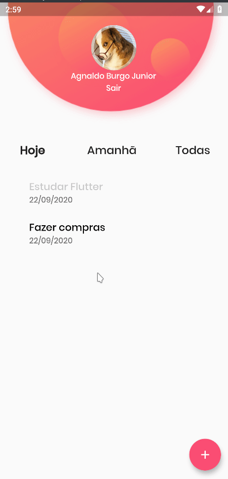

<div align="center" >
  
</div>
<h1 align="center" >
  Todo App
</h1>

<h4 align="center">
  Um aplicativo com uma linda interface para gerenciamento de tarefas
</h4>
<div align="center" >
  

</div>

<p align="center">
  <a href="#large_blue_diamond-sobre">Sobre</a>&nbsp;&nbsp;&nbsp;|&nbsp;&nbsp;&nbsp;
  <a href="#large_blue_diamond-conteudo-estudado">Conteúdo estudado</a>&nbsp;&nbsp;&nbsp;|&nbsp;&nbsp;&nbsp;
  <a href="#large_blue_diamond-tecnologias">Tecnologias</a>&nbsp;&nbsp;&nbsp;|&nbsp;&nbsp;&nbsp;
  <a href="#large_blue_diamond-como-utilizar">Como instalar</a>
</p>
<br/>

## :large_blue_diamond: Sobre

Este é mais um Todo List. Dessa vez, nesta aplicação temos um belo design junto com as funcionalidades de login com Google, adicionar tarefas, listagem de tarefas e marcação de tarefa feita.

Este é um projeto de estudos e foi dado ênfase na parte de arquitetura, utilizando MVC e Repository Pattern, gerenciamento de estados com MobX e Singleton Pattern.
Além disso, como utilizar serviços consumindo APIS.

Os valores estão mocados no projeto pois a API não está disponível.

Este projeto foi desenvolvido no curso: Todo App: Mobile com Flutter, MobX e Firebase, do [Balta.io](https://balta.io/).
<br/>
<br/>

## :large_blue_diamond: Conteudo estudado

Neste projeto de estudo foram vistos os seguintes conteúdos:

- Desenvolvimento de interfaces no Flutter
- Utilização de Snackbar, Dialogs e Datepicker com Flutter
- Firebase: configuração e autenticação com o Google
- Utilização de APIs pelo aplicativo utilizando o Dio
- Arquitetura MVC e Repository Pattern
- MobX e gerenciamento de estados
- Provider e singleton pattern
- Utilização de temas
  <br/>
  <br/>

## :large_blue_diamond: Tecnologias

Este projeto foi desenvolvido com as seguintes tecnologias

- [Flutter](https://flutter.dev/)
- [Firebase](https://firebase.google.com/)
- [MobX](https://mobx.js.org/README.html)
- [Provider](https://pub.dev/packages/provider)
- [Dio](https://pub.dev/packages/dio)
- [Intl](https://pub.dev/packages/intl)
- [VS Code][vc]
  <br/>
  <br/>

## :large_blue_diamond: Como utilizar

Para rodar a aplicação você precisa ter o [Git](https://git-scm.com) e [Flutter](https://flutter.dev/) na sua máquina. Você precisará também de um emulador para Android ou IOS.
Como sugestão, utilize o emulador Android do [Android Studio](https://developer.android.com/studio) ou o [Genymotion](https://www.genymotion.com/).

A API para este projeto não está disponível e por isso os dados listados bem como o login estão <i>mocados</i>.

Abra seu emulador e siga os comandos abaixo em seu terminal:

```bash
# Clone this repository
$ git clone https://github.com/agnaldoburgojr/todo-app-2.git todo

# Go into the repository
$ cd todo

# Run the app
$ flutter run
```

<br/>

## :large_blue_diamond: Licença

Este projeto possui Licença MIT. Olhe [LICENSE](https://github.com/agnaldoburgojr/contact-app/blob/master/LICENCE) para mais informações.

<br/>

---

Feito com ♥ por Agnaldo Burgo Junior :wave: [Get in touch!](https://www.linkedin.com/in/agnaldo-burgo-junior/)

[vc]: https://code.visualstudio.com/
